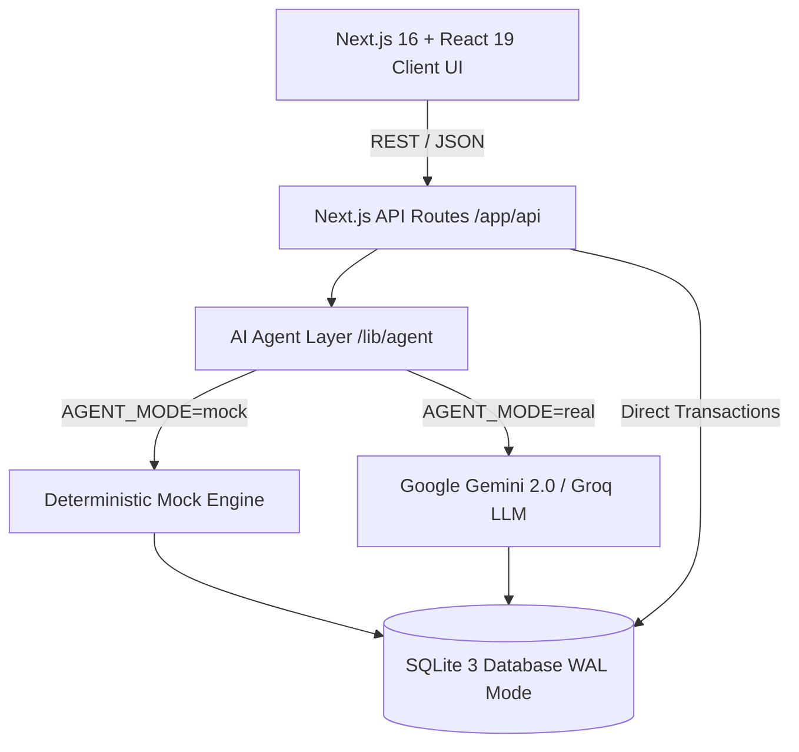

# Cartwise Plus — Next-Gen AI-Powered E-Commerce Storefront

[](https://nextjs.org/)
[](https://react.dev/)
[](https://tailwindcss.com/)
[](https://www.sqlite.org/)
[](https://ai.google.dev/)

**Cartwise Plus** is a luxury, enterprise-grade e-commerce storefront integrated with an autonomous multi-agent AI Shopping Assistant. Built with Next.js 16, React 19, and Tailwind CSS, it blends a sleek **Onyx Black & Amber Gold** visual identity with real-time catalog search, visual product recognition, multilingual voice synthesis, atomic cart checkout, and 15-minute express delivery tracking.

---

## ✨ 1. Key Features & Capabilities

### 🛒 Luxury Storefront & Real-World Product Catalog
- **Luxury Black & Gold Theme**: Premium obsidian surfaces (`#0b0f17`), warm amber/gold accents (`#f59e0b` / `text-amber-400`), and crisp high-contrast cards.
- **11 Broad Categories & Real-World Products**:
  - ⚡ **For You** (Personalized Deals & Recommendations)
  - 👕 **Fashion** (Designer Silk Sarees, Cotton Kurtas, Polo T-Shirts)
  - 📱 **Mobiles** (Motorola edge 70 Fusion, Apple iPhone 15, Samsung Galaxy S24 Ultra)
  - 💻 **Electronics** (ASUS Vivobook 15 OLED, TCL 43" 4K QLED TV, ANC Wireless Neckbands)
  - 🔥 **Beauty** (Vitamin C Serum, 100% Pure Moroccan Argan Oil)
  - 🏠 **Home & Living** (Handcrafted Teakwood Spoons, Ceramic Pots)
  - 📺 **Appliances** (Air Fryers, Microwaves, Electric Kettles)
  - 👶 **Toys, Baby & Kids** (Educational Wooden Blocks, Soft Toys)
  - 💖 **Food & Health** (Cold-Extracted Raw Forest Honey, A2 Desi Cow Ghee)
  - 🚗 **Auto Accessories** (High-Pressure Car Washers, Dash Cams)
  - 🏆 **Sports & Fitness** (Neoprene Dumbbell Sets, Yoga Mats)
- **Top Tech Deals Revealed**: Smooth horizontal carousel displaying flagship tech products and instant deal prices.
- **Indian Rupee (`₹` / INR)**: All items, vouchers, cart calculations, and GST invoices formatted cleanly in Indian Rupees.
- **Quick View Modal (`ProductDetailModal`)**: High-res image galleries, stock counters, verified review breakdowns, Cartwise Plus Assured badges, and instant "Ask AI about this item" actions.

---

### 🤖 Multi-Agent AI Shopping Copilot
- **Deterministic Grounding**: Backed directly by SQLite store records—zero hallucinations or phantom products.
- **Multi-Turn Chat & Tool Calling**: Search by natural language specifications (*"Find me a curved screen 5G smartphone under ₹30,000 with 12GB RAM"*).
- **Instant Price Arbitrage & Promos**: Auto-applies voucher codes (e.g. `SAVE10` for flat 10% instant bank discounts).
- **Multimodal Vision Search (Photo Lookup)**: Upload or snap product photos; the vision agent extracts attributes, checks inventory, and returns exact matches.
- **Multilingual Voice Assistant (STT & TTS)**:
  - **Speech-to-Text**: Real-time microphone listening supporting **English (`en-IN`)**, **Hindi (`hi-IN`)**, and **Bengali (`bn-IN`)**.
  - **Text-to-Speech**: Instant natural voice reading with auto-speak toggles.
- **Transparent Agent Trace Inspector**: View step-by-step SQL queries, parsed intents, and execution timings.

---

### 📦 15-Minute Express Delivery & Live Order Tracking
- **4-Stage Order Lifecycle**: Order Placed ➔ Packed & Inspected ➔ Out for Delivery ➔ Delivered.
- **Live Countdown Timer**: Real-time minute & second arrival countdown.
- **Delivery Partner Card**: Rider contact, vehicle registration, and OTP verification code.
- **Satellite GPS Modal**: Simulated interactive real-time map with live delivery coordinates.
- **GST Tax Invoices**: Downloadable and printable GST-compliant invoices with itemized taxes (CGST 9% + SGST 9%).

---

### 📱 Full-Screen & Mobile Responsiveness
- **Desktop & Ultra-Wide Monitors (≥1024px, 1440p, 4K)**: Fluid `max-w-[1600px]` width with dual-column grid (`8 cols` Storefront + `4 cols` Sticky Copilot).
- **Adaptive 4-Column Card Grid**: Smoothly scales from 1 card on mobile to 4 cards on ultra-wide screens.
- **Mobile Screens (<640px)**:
  - Two-tier header: Monogram logo + cart/profile on row 1, full-width search on row 2.
  - Mobile hamburger drawer with saved addresses and preferences.
  - Segmented switcher pill (*Explore Products* ↔ *AI Assistant*).
  - Touch-scrollable category ribbon with momentum scrolling.
  - Safe bottom insets (`pb-24 sm:pb-8`) preventing obstruction by navigation bars.

---

## 🏗️ 2. Architecture & Tech Stack



| Layer | Technology |
| :--- | :--- |
| **Framework** | [Next.js 16 (App Router)](https://nextjs.org/) |
| **UI Library** | [React 19](https://react.dev/) + [Lucide React Icons](https://lucide.dev/) |
| **Styling** | [Tailwind CSS v4](https://tailwindcss.com/) with Black & Gold custom palette |
| **Database** | [better-sqlite3](https://github.com/WiseLibs/better-sqlite3) (WAL journal mode) |
| **AI LLM / Vision** | [Google Gemini Flash / Groq SDK](https://ai.google.dev/) |
| **Voice Engine** | Web Speech API (SpeechRecognition + SpeechSynthesis) |

---

## 📂 3. Folder Structure

```text
CartWise-main/
├── app/
│   ├── api/
│   │   ├── addresses/route.ts        # Saved delivery addresses endpoint
│   │   ├── cart/route.ts             # Atomic cart add/update/delete
│   │   ├── chat/route.ts             # Multi-agent chat router & tool executor
│   │   ├── checkout/route.ts         # Order creation & stock deduction
│   │   ├── image-search/route.ts     # Visual product recognition
│   │   ├── orders/route.ts           # Order history & status simulation
│   │   ├── payment/                  # Razorpay / UPI order creation
│   │   └── products/route.ts         # Categorized catalog lookup & filters
│   ├── globals.css                   # Obsidian Black, Amber Gold & Tailwind tokens
│   ├── layout.tsx                    # Root layout with metadata & fonts
│   └── page.tsx                      # Main Storefront & Copilot dual-column page
├── components/
│   ├── Navbar.tsx                    # Two-tier header, mobile drawer & category ribbon
│   ├── ChatInput.tsx                 # Multimodal input (text, photo upload, voice STT)
│   ├── auth/
│   │   ├── AddressModal.tsx          # Saved delivery addresses modal
│   │   ├── AuthModal.tsx             # Login & VIP member registration modal
│   │   └── PersonalisationModal.tsx  # Dietary & AI preferences modal
│   ├── cart/
│   │   ├── AddNewAddressModal.tsx    # Address addition dialog
│   │   ├── CardSecurityModal.tsx     # 3D Secure / CVV payment modal
│   │   ├── CartDrawer.tsx            # 3-step checkout drawer with UPI/Card/COD
│   │   ├── DynamicUpiQrModal.tsx     # Dynamic UPI QR code with live timer
│   │   └── InvoiceModal.tsx          # GST Tax Invoice download & print modal
│   ├── chat/
│   │   ├── AgentTraceModal.tsx       # Internal SQL & reasoning trace inspector
│   │   ├── ClarifyMessage.tsx        # Interactive clarification buttons
│   │   ├── CompareMessage.tsx        # Side-by-side product comparison tables
│   │   ├── EmptyChatPrompt.tsx       # Suggested prompts & queries
│   │   ├── EmptyStateMessage.tsx     # Empty state handler with suggestions
│   │   ├── ImageAnalysisMessage.tsx  # Visual search results with dietary tags
│   │   ├── ProductsMessage.tsx       # Interactive product cards in chat
│   │   ├── SatelliteGpsModal.tsx     # Real-time satellite delivery tracking map
│   │   ├── TextMessage.tsx           # Markdown-rendered assistant bubble
│   │   ├── ThinkingMessage.tsx       # Animated thinking state indicator
│   │   └── UserBubble.tsx            # User speech & text bubble
│   ├── orders/
│   │   └── OrdersView.tsx            # Order history, live progress bar & reorder
│   └── product/
│       └── ProductDetailModal.tsx    # Comprehensive product quick-view modal
├── context/
│   ├── CartContext.tsx               # Cart state, subtotal & active tab provider
│   ├── UserContext.tsx               # User auth, active address & dietary preferences
│   └── VoiceContext.tsx              # Multilingual STT & TTS speech engine
├── data/
│   └── store.db                      # SQLite 3 database file
├── lib/
│   ├── agent/                        # AI Agent orchestration (mock vs real)
│   ├── db.ts                         # SQLite connection & schema initializer
│   ├── invoice.ts                    # GST Invoice calculation & generation
│   ├── storeData.ts                  # Reference seed catalog with 11 categories
│   └── types.ts                      # TypeScript type definitions
└── scripts/
    └── seed.ts                       # Database reset & seeding script
```

---

## 🚀 4. Quick Start Guide

### Prerequisites
- **Node.js**: v18.0.0 or higher (v20+ recommended)
- **npm** or **pnpm**

### Step-by-Step Setup

```bash
# 1. Clone the repository
git clone https://github.com/coder-soumyadip29/E_Commerce-Agent.git
cd E_Commerce-Agent

# 2. Install dependencies
npm install

# 3. Configure environment variables
cp .env.example .env
# Edit .env to set your GEMINI_API_KEY or keep AGENT_MODE=mock for local demo

# 4. Seed the database with 11 real-world product categories
npm run db:seed

# 5. Start the local development server
npm run dev
```

Open [http://localhost:3000](http://localhost:3000) in your browser to view Cartwise Plus.

---

## ⚡ 5. Environment Configuration (`.env`)

```env
# Agent Execution Mode: 'mock' (standalone deterministic) or 'real' (Gemini / Groq LLM)
AGENT_MODE=mock

# Gemini API Key (Required if AGENT_MODE=real)
GEMINI_API_KEY=your_gemini_api_key_here

# Groq API Key (Optional alternative LLM provider)
GROQ_API_KEY=your_groq_api_key_here

# Next.js Port (Default 3000)
PORT=3000
```

---

## 🧪 6. Testing & Demo Scenarios

### Multimodal Vision Search:
1. **Raw Forest Honey**: Click the camera icon or select `Photo Search` ➔ matches *Organic Raw Forest Honey*.
2. **Whole Grain Oats**: Upload `oats.png` ➔ returns gluten-free oats & breakfast granola.
3. **Non-Product Images**: Upload an animal or object photo ➔ returns friendly advice with zero false matches.

### Multilingual Voice Search:
- Click the microphone icon in the chat bar.
- Speak in **English** (*"Show me flagship 5G mobiles"*), **Hindi** (*"मुझे ऑर्गेनिक शहद और ड्राई फ्रूट्स दिखाओ"*), or **Bengali** (*"আমাকে সেরা ল্যাপটপ আর স্মার্টফোন দেখাও"*).

### Promo Arbitrage & Discount:
- Ask: *"Apply discount code SAVE10"* ➔ receives 10% instant price deduction.

---

## 📄 7. License
This project is licensed under the **MIT License**.
