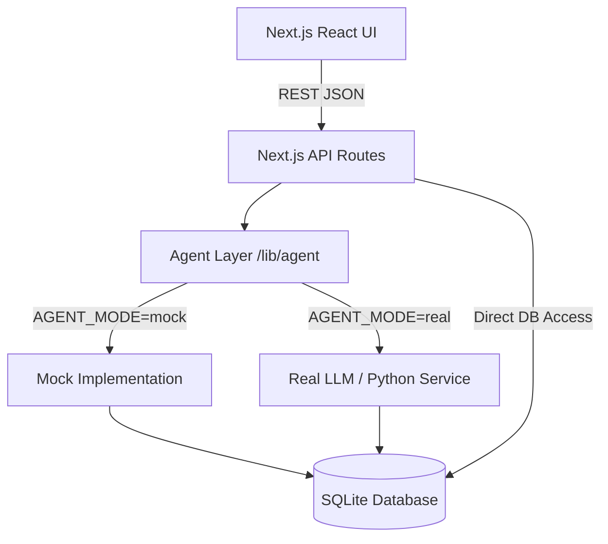

# CartWise

## 1. PROJECT OVERVIEW
CartWise is a Next.js-based e-commerce platform integrated with a multi-agent AI shopping assistant powered by Groq and Gemini. The goal is to provide users with a conversational interface capable of semantic product searches, image recognition, and product comparison, all backed by a deterministic SQLite catalog.

Currently, the application runs a fully featured mock agent (`AGENT_MODE=mock`) that simulates the intended AI functionality using hardcoded heuristics mapped to actual SQLite data. The shopping cart, checkout, order history, database, and responsive UI components are completely built and functional.

## 2. STATUS

### Done
- Responsive UI screens mapping to all Desktop and Mobile designs.
- SQLite database integration (`better-sqlite3`) with products, reviews, and orders tables.
- Robust cart state management (stored server-side in SQLite `cart_items`).
- 3-step checkout flow handling atomic transactions and zero-stock validation.
- Agent trace panel to inspect parsed intents, active filters, and SQL queries.
- Mock agent engine returning structured JSON messages based on deterministic triggers.
- Image demo cases simulating visual recognition for honey, oats, and non-product (elephant) images.
- Comprehensive Vitest test suite for the backend API logic.

### Remaining
- Real LLM agents with Groq (for fast text reasoning) and Gemini (for multimodal/vision tasks).
- Real image embeddings for open-ended visual product recognition.
- A bigger product catalog beyond the 32 seeded items.
- Vector-based semantic search and smarter product ranking algorithms.
- Review summaries from real review text utilizing actual NLP.
- Strict prompt guardrails and LLM output evaluation to prevent hallucinations.
- Proper user authentication and dynamic address mapping for the checkout process.

## 3. QUICK START
```bash
# 1. Install dependencies
npm install

# 2. Setup Environment Variables
cp .env.example .env

# 3. Seed the Database
npm run db:seed

# 4. Run the development server
npm run dev

# 5. Run tests (optional)
npm run test
```
To reset the database to a clean state at any time, just re-run:
```bash
npm run db:seed
```

## 4. ARCHITECTURE


The `AGENT_MODE` environment variable dictates whether the application uses the deterministic mock engine (`mock`) or attempts to call real LLM APIs (`real`). If `AGENT_MODE=real` but no API keys are present, the system gracefully falls back to the mock engine to prevent crashes.

## 5. FOLDER STRUCTURE
```text
cartwise/
├── app/                  # Next.js App Router (Layout, Page, Global CSS, and API endpoints)
├── components/           # Modular React UI components (Cart, Chat UI, Navigation)
├── context/              # Client-side React context (CartContext)
├── data/                 # Live runtime database storage (store.db)
├── design/               # Reference HTML mockups and design assets
├── docs/                 # Project documentation and audit reports
├── lib/                  # Backend logic, DB clients, and Agent contracts
│   └── agent/            # AI Agent orchestration layer (mock vs real)
├── public/               # Static assets & public images
├── reference/            # Mentor source files and pristine database seed scripts
├── scripts/              # Setup and seeding utility scripts
└── tests/                # Vitest automated API and database tests
```

## 6. DATABASE
CartWise uses SQLite 3 (`better-sqlite3`) in WAL journal mode.

**Tables:**
- `products`: `id`, `name`, `category`, `price`, `description`, `is_organic`, `stock`
- `reviews`: `id`, `product_id`, `rating`, `reviewer_name`, `review_text`
- `orders`: `id`, `total`, `status`, `created_at`
- `order_items`: `id`, `order_id`, `product_id`, `product_name`, `unit_price`, `quantity`
- `cart_items`: `id`, `session_id`, `product_id`, `quantity`, `added_at`

**Views:**
- `ratings_summary`: Aggregates average rating and review counts per product.

**Seed & Reset:**
Database seeding and reset is handled via `npm run db:seed`, which executes `scripts/seed.ts` to wipe the existing tables and insert the clean reference data.

## 7. API REFERENCE
- **GET `/api/products`**
  - Params: `q`, `category`, `is_organic`, `max_price`, `min_rating`, `id`
  - Response: `{ "success": true, "products": [...] }`
- **GET/POST/PATCH/DELETE `/api/cart`**
  - POST body: `{ "productId": 1, "quantity": 1 }`
  - Response: `{ "success": true, "cart": [...] }`
- **GET `/api/orders`**
  - Response: `{ "success": true, "orders": [...] }`
- **POST `/api/checkout`**
  - Response: `{ "success": true, "order": { "id": 1, "total": 14.99, ... } }`
- **POST `/api/orders/[id]/reorder`**
  - Response: `{ "success": true }`
- **POST `/api/chat`**
  - Body: `{ "messages": [{ "role": "user", "content": "organic honey" }] }`
  - Response: `{ "success": true, "message": { "type": "products", ... } }`
- **POST `/api/image-search`**
  - Body: `{ "imageName": "honey.png" }`
  - Response: `{ "success": true, "message": { "type": "image_analysis", ... } }`

## 8. MESSAGE CONTRACT
The UI relies on strict JSON structured messages from the Agent Layer.
- **text**: `{ "type": "text", "text": "..." }`
- **products**: `{ "type": "products", "products": [...], "text": "..." }`
- **image_analysis**: `{ "type": "image_analysis", "tags": [...], "description": "...", "matchedProducts": [...] }`
- **clarify**: `{ "type": "clarify", "question": "...", "options": [...] }`
- **compare**: `{ "type": "compare", "products": [...], "comparisonPoints": { "Price": [...], ... } }`
- **empty_state**: `{ "type": "empty_state", "reason": "...", "suggestions": [...] }`

## 9. THE AGENT LAYER
The Agent Layer is encapsulated in `lib/agent/`. It exposes two primary functions in `index.ts`:
- `handleChat(messages: ChatMessage[]): Promise<AssistantMessage>`
- `handleImage(imageInput: string | Buffer | File): Promise<AssistantMessage>`

These functions must return one of the predefined structured message types from the contract above. To implement a real external Python service or LLM logic, you can modify `real.ts` to forward the payload and parse the structured output back into the required `AssistantMessage` interfaces.

## 10. DESIGN
The UI is strictly based on the mockups in the `/design` folder. 

**Screen to Component Mapping:**
| Design Folder | Implemented Component |
| :--- | :--- |
| `cartwise_empty_chat_4a` / `cartwise_mobile_empty_chat_1` | `components/chat/EmptyChatPrompt.tsx` |
| `cartwise_thinking_state_4b` / `cartwise_mobile_thinking_state_2` | `components/chat/ThinkingMessage.tsx` |
| `cartwise_no_results_4c` / `cartwise_mobile_no_results_3` | `components/chat/EmptyStateMessage.tsx` |
| `cartwise_image_search_*` / `cartwise_mobile_vision_*` | `components/chat/ImageAnalysisMessage.tsx` |
| `cartwise_compare_products_1d` / `cartwise_mobile_compare_honeys` | `components/chat/CompareMessage.tsx` |
| `cartwise_cart_*` / `cartwise_review_order_*` / `cartwise_order_confirmed_*` | `components/cart/CartDrawer.tsx` |
| `cartwise_your_orders` / `cartwise_mobile_your_orders` | `components/orders/OrdersView.tsx` |
| `cartwise_ai_product_search_agent_trace` | `components/chat/AgentTraceModal.tsx` |

**Design Rules:** 
- No invented data is permitted in the UI (e.g., no hallucinatory badges or tax sums).
- Product names are **never** CSS truncated (`text-ellipsis` is explicitly avoided).
- Action buttons **never** wrap awkwardly (`whitespace-nowrap`).
- The chat input must dynamically resize and **never** cover scrollable content.

## 11. KNOWN ISSUES
- **Mock Mode Image Recognition is Keyword/Filename-Based:** In `lib/agent/mock.ts`, `handleMockImage` uses filename checks (`honey`, `oats`, `elephant`, `oil`). If a user uploads an image named `photo_123.jpg`, it falls back to the generic product match rather than performing true visual embeddings (which requires `AGENT_MODE=real` with an active vision LLM key). (File: `lib/agent/mock.ts:220`)

## 12. TESTING
Run the backend and API test suite using:
```bash
npm run test
```
**Demo Vision Cases:**
1. Upload `honey.png`: Returns "Organic Raw Honey" tags and 3 honey products.
2. Upload `oats.png`: Returns "Whole Grain Oats" tags and 3 oat/granola products.
3. Upload `elephant.png`: Returns a warning for a non-product image and 0 matches.
